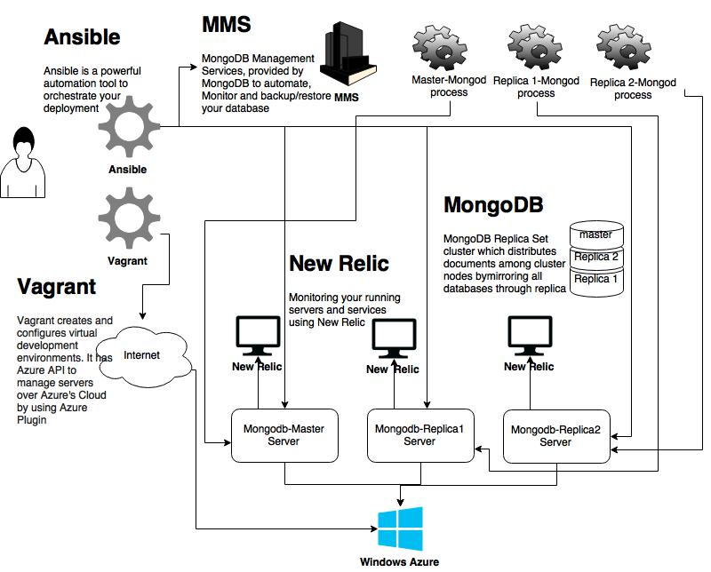

# Deploy MongoDB Cluster on Windows Azure

This package is a libaray based on Ansible and Vagrant to deploy and manage a mongoDB cluster
on Windows Azure. It installs and configures MMS (MongoDB Management System) over MongoDB
Cloud also it uses NewRelic (A software analytics tool suite) to monitor MongoDB cluster servers
and the running services on your cluster. The following steps describe how to manage monogDB
services (Mongod), automate backup/restore over cloud, monitor mongo services and monitor
all running services in your infrastructure to make sure that it satisfies the availability and
consistency of Mongo database.

# Basic Cluster Architecture

# Install and Configure Vagrant

**Install Vagrant on Ubuntu distribution:**

        $ sudo apt-get install vagrant

 but I suggest to install Vagrant Binary from [here](http://www.vagrantup.com/downloads.html)

**Install Azure Vagrant Plugin**

         $ vagrant plugin install vagrant-azure

**Download this dummy box that vagrant need to use the azure provider**

        $ vagrant box add azure https://github.com/msopentech/vagrant-azure/raw/master/dummy.box

# Install Windows Azure CLI

 **1. Ubuntu 12.04 LTS Precise Pangolin:**

        $ sudo apt-get install curl
        $ curl -sL https://deb.nodesource.com/setup | sudo bash -
        $ sudo apt-get install -y nodejs
        $ sudo npm install -g azure-cli

 **2. Ubuntu 14.04 LTS Trusty Tahr:**

        $ sudo apt-get install nodejs-legacy
        $ sudo apt-get install npm
        $ sudo npm install -g azure-cli

        $ azure
        info:             _    _____   _ ___ ___
        info:            /_\  |_  / | | | _ \ __|
        info:      _ ___/ _ \__/ /| |_| |   / _|___ _ _
        info:    (___  /_/ \_\/___|\___/|_|_\___| _____)
        info:       (_______ _ _)         _ ______ _)_ _
        info:              (______________ _ )   (___ _ _)
        info:
        info:    Microsoft Azure: Microsoft's Cloud Platform_
        info:
        info:    Tool version 0.9.5
        help:
        help:    Display help for a given command
        help:      help [options] [command]
        help:
        help:    Log in to an Azure subscription using Active Directory. Currently, the user can login only via Microsoft organizational account
        help:      login [options] [username]
        help:
        help:    Log out from Azure subscription using Active Directory. Currently, the user can log out only via Microsoft organizational account
        help:      logout [options] [username]
        help:
        help:    Open the portal in a browser
        help:      portal [options]
        help:
        help:    Commands:
        help:      account        Commands to manage your account information and publish settings
        help:      config         Commands to manage your local settings
        help:      hdinsight      Commands to manage HDInsight clusters and jobs
        help:      mobile         Commands to manage your Mobile Services
        help:      network        Commands to manage your Networks
        help:      sb             Commands to manage your Service Bus configuration
        help:      service        Commands to manage your Cloud Services
        help:      site           Commands to manage your Web Sites
        help:      sql            Commands to manage your SQL Server accounts
        help:      storage        Commands to manage your Storage objects
        help:      vm             Commands to manage your Virtual Machines
        help:
        help:    Options:
        help:      -h, --help     output usage information
        help:      -v, --version  output the application version

# Create and manage Azure's certificates

 **1. Download your Management Certificate for Azure CLI:**

         $ azure account download
         info:    Executing command account download
         info:    Launching browser to **http://go.microsoft.com/fwlink/?LinkId=254**
         help:    Save the downloaded file, then execute the command
         help:      account import <file>
         info:    account download command OK

 keep this file in safe place.

 **2. Import the certificate to your azure account**

	$ azure account import myfile.publishsettings
        info:    Executing command account import
        info:    account import command OK

 **3. Check your account list:**

       $ azure account list
       info:    Executing command account list
       data:    Name      Id                                    Tenant Id  Current
       data:    --------  ------------------------------------  ---------  -------
       data:    ACCOUNT  b80dxxxxxxxxxxxxxxxxxxxxxxxxxxxxxxxxx  undefined  true
       info:    account list command OK

 **4. Create an X.509 certificate to authenticate with Azure**

       $ openssl req -x509 -nodes -days 3650 -newkey rsa:2048 -keyout cert.pem -out cert.pem

 **5. Create Microsoft Parallel FX from the X.509 cert**

       #Enter the encryption password
       $ openssl pkcs12 -export -out cert.pfx -in cert.pem -name "My Cert"

 **6.Create service certificate to upload to Azure**

       $ openssl x509 -inform pem -in cert.pem -outform der -out cert.cer

 Now login to Azure management portal [here](https://manage.windowsazure.com) to upload .cer file certificate

       SETTINGS --> MANAGEMENT CERTIFICATES --> UPLOAD

 **7. Create RSA private keys**

   Do not do this step if you have a RSA private key to check use  `ls ~/.ssh/` and skip to login keys

   Create RSA private key so that you can log in with your normal credentials

       $ ssh-keygen -t rsa

   Create login keys

       $ openssl req -new -x509 -key ~/.ssh/id_rsa -out ~/.ssh/ssh-cert.pem

**8. Copy all certificates to cert directory**

	$ cp cert.* cert/

# Install and Configure Ansible

 **Ubuntu LTS 12.04**

       $ sudo apt-get install software-properties-common
       $ sudo apt-add-repository ppa:ansible/ansible
       $ sudo apt-get update
       $ sudo apt-get install ansible

 **Other Linux Distributions**

 to install on another Linux Distribution check out [Ansible Docs](http://docs.ansible.com/intro_installation.html)

# Configure your Vagrant File

**Open Vagrantfile, and edit the following lines:**

	azure.subscription_id = 'XXXXXXXXXXXXXXXXXXXXXXXXXXXXXXX'
	azure.storage_acct_name = 'YOUR_STORAGE_ACCOUNT'
	azure.vm_user = 'ahmed' # change to username on your local host
	azure.ssh_private_key_file = '/home/ahmed/.ssh/id_rsa'  # change the path of id_rsa to yours
        azure.ssh_certificate_file = '/home/ahmed/.ssh/ssh-cert.pem' # change the path of ssh-cer.pem to yours
  ....
  azure.ssh_port = 2200
  azure.tcp_endpoints = '40000:40000,40001:10100,40002:10400'

**To Add new replica server uncomment the following block**

where this section describes a new replica server with specific endpoints configuration and different ssh port
Note: All running cluster nodes are joined into one cloud service to satisfy the affinity option where Affinity
group keep them within the same datacenter, so I used port forwarding to map internal ssh '22' to a public port 2203
in this case.

	# TO ADD EXTRA SECONDARY MONGODB SERVERS UNCOMMENT THE FOLLOWING LINES
	#config.vm.define 'slave3' do |cfg|
	#  cfg.vm.provider :azure do |azure, override|
	#    common_azure.call azure, override
	#    azure.vm_name = 'secondary-node3'
	#    azure.ssh_port = 2203
	#    azure.tcp_endpoints = '40002:40003,40001:40100, 40000:40400'
	#  end
	#end

so you can add any number of servers by adding new blocks as listed above, but with different port numbers and
different vm name.

# Edit/Create Hosts file

Hosts file is a file used by Ansible, the following data must be matched with vagrant data
as shown above in vagrant file section

1. ssh port for master node is <code>azure.ssh_port = 2200</code>
2. TCP endpoints <code>azure.tcp_endpoints = '40000:40000,40001:10100,40002:10400'</code>  
3. Host name <code>azure.cloud_service_name = 'mongo-azure-tests'</code>, where cloud service is a
unique name, so the final domain name will be <code>mongo-azure-tests.cloudapp.net</code>  
4. User name <code>azure.vm_user = 'ahmed'</code>

**Hosts file**

    [mongo_servers]
    ansible_ssh_port=<code>2200</code>   ansible_ssh_host=<code>mongo-azure-tests.cloudapp.net</code>  ansible_ssh_user=<code>ahmed</code>  mongod_port=<code>40000</code>
    ........
    ........

# Configure secret and admin passwords:

Once you have edited your Vagrant file, now it is the time to add mongodb secret and admin password, which is used
for database authentication.

	$ vi group_vars/all

	edit this line:
		# The password for admin user
		mongo_admin_pass: YOURADMINPASS

generate any 64 bit characters as a key file and add them to secret file, for more information about how to create
it check out this [link](http://docs.mongodb.org/manual/tutorial/generate-key-file/):

	$ openssl rand -base64 741 > secret
	$ cp secret /roles/mongod/files/secret

# NewRelic Server Monitor

Here I introduce how to get your NewRelic license key to port it into your ansible, to keep
your servers monitored

        1- login to windows azure portal
        2- select Marketplace ---> from popup select NewRelic app service
        3- once NewRelic Service is up, from NewRelic dashboard in windows azure click on Manage "at the bottom of page"
        4- from NewRelic account select servers from the tap on the top of page.
        5- choose your platform by clicking on 'RedHat Enterprise Linux 5+, Centos 5+'.
        6- scrol down to the end of the page and copy your license key as show below.
                    license_key=55bbd90f482XXXXXXXXXXXXXXXXXXXXXXX_
        7- add this license key in this file mongo-azure/roles/newrelic/defaults/main.yml

# MongoDB Management Service (MMS)

        1- create New MMS free account from mms portal https://mms.mongodb.com/
        2- Once you login to your account click on Begin setup button.
        3- select Manage Existing to manage your MongoDB on Azure.
        4- click on install agent and select RHEL/Centos(5.x,6.x)/SUSE/Amazon
        5- From the pop-up screen get the following two arguments

			mmsGroupId=558a6XXXXXXXXXXXXXXXXXXXXX
			mmsApiKey=eeb066XXXXXXXXXXXXXXXXXXXXX

        add these values in this file: mongo-azure/roles/mms/files/automation-agent.config.j2

# Start MongoDB Deployment

**Step 1: Create Cluster Using Vagrant**

	$ vagrant up --provider azure

**Step 2:  start mongodb-full deployment by using Ansible:**

	$ ansible-playbook -i hosts playbook.yml -vvvv

Your cluster is ready check your NewRelic and MMS services

# Backup/Restore management using MMS

Your Cluster backup services is managed by MMS, check out [MMS](https://mms.mongodb.com) and install monitor agents and backup agents. To enable backup service from backup tab you will be charged for backup.

# MongoDB Member Recovery

This section describes how to recover your failed instances within MongoDB cluster, first create Azure node using vagrant

     $ vagrant up --provider azure

then recover your missing nodes

     $ ansible-playbook -i hosts recover.yml -vvvv
